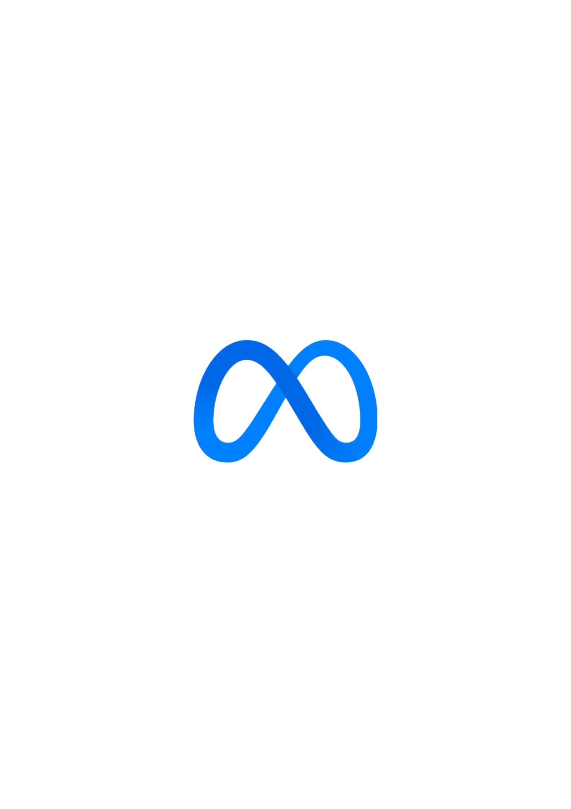

<!DOCTYPE html>
<html>
    <head>
        <title>
            marksoy.edits
        </title>
        
    </head>
    <body> 

        

        

        

        

        

        <h1 id = "hi">Hello! I'm Mark Jason</h1>

        

            I'm a video editor based in the Philippines, dedicated to transforming raw footage 
            into captivating visual experiences. I'm committed to turning your vision into reality, 
            so whether you're a filmmaker, content creator, or business owner seeking professional video
             editing, I'm here to collaborate and bring your ideas to life.
             <b><i>
                Feel free to reach out to me by clicking on the
             image corresponding to the platform you prefer. I'll be glad to connect with you there!
             </i>
            </b>
        

        
WORK SAMPLES:

        <video id= "vid1" src = "1.mp4" height = "450px" width = "210px" controls controlslist = "nodownload" muted autoplay loop> </video>
        <video id= "vid2" src = "2.mp4" height = "450px" width = "210px" controls controlslist = "nodownload" muted autoplay loop> </video>
        <video id= "vid3" src = "3.mp4" height = "450px" width = "210px" controls controlslist = "nodownload" muted autoplay loop> </video>
        <video id= "vid4" src = "4.mp4" height = "450px" width = "210px" controls controlslist = "nodownload" muted autoplay loop> </video>
        <video id= "vid5" src = "26.mp4" height = "450px" width = "210px" controls controlslist = "nodownload" loop> </video>
        <video id= "vid6" src = "6.mp4" height = "450px" width = "210px" controls controlslist = "nodownload" loop> </video>
        <video id= "vid7" src = "35.mp4" height = "450px" width = "210px" controls controlslist = "nodownload" loop> </video>
        <video id= "vid8" src = "42.mp4" height = "450px" width = "210px" controls controlslist = "nodownload" loop> </video>
        <video id= "vid9" src = "9.mp4" height = "450px" width = "210px" controls controlslist = "nodownload" loop> </video>
        <video id= "vid10" src = "10.mp4" height = "450px" width = "210px" controls controlslist = "nodownload" loop> </video>
        <video id= "vid11" src = "11.mp4" height = "450px" width = "210px" controls controlslist = "nodownload" loop> </video>
        <video id= "vid12" src = "12.mp4" height = "450px" width = "210px" controls controlslist = "nodownload" loop> </video>
        <video id= "vid13" src = "13.mp4" height = "450px" width = "210px" controls controlslist = "nodownload" loop> </video>
        <video id= "vid14" src = "14.mp4" height = "450px" width = "210px" controls controlslist = "nodownload" loop> </video>
        <video id= "vid15" src = "15.mp4" height = "450px" width = "210px" controls controlslist = "nodownload" loop> </video>
        <video id= "vid16" src = "16.mp4" height = "450px" width = "210px" controls controlslist = "nodownload" loop> </video>
        <video id= "vid17" src = "17.mp4" height = "450px" width = "210px" controls controlslist = "nodownload" loop> </video>
        <video id= "vid18" src = "18.mp4" height = "450px" width = "210px" controls controlslist = "nodownload" loop> </video>
        <video id= "vid19" src = "19.mp4" height = "450px" width = "210px" controls controlslist = "nodownload" loop> </video>
        <video id= "vid20" src = "20.mp4" height = "450px" width = "210px" controls controlslist = "nodownload" loop> </video>
        <video id= "vid21" src = "21.mp4" height = "450px" width = "210px" controls controlslist = "nodownload" loop> </video>
        <video id= "vid22" src = "22.mp4" height = "450px" width = "210px" controls controlslist = "nodownload" loop> </video>
        <video id= "vid23" src = "23.mp4" height = "450px" width = "210px" controls controlslist = "nodownload" loop> </video>
        <video id= "vid24" src = "24.mp4" height = "450px" width = "210px" controls controlslist = "nodownload" loop> </video>
        <video id= "vid25" src = "25.mp4" height = "450psx" width = "210px" controls controlslist = "nodownload" loop> </video>
        <video id= "vid26" src = "5.mp4" height = "450px" width = "210px" controls controlslist = "nodownload"  loop> </video>
        <video id= "vid27" src = "27.mp4" height = "450px" width = "210px" controls controlslist = "nodownload" loop> </video>
        <video id= "vid28" src = "28.mp4" height = "450px" width = "210px" controls controlslist = "nodownload" loop> </video>
        <video id= "vid29" src = "29.mp4" height = "450px" width = "210px" controls controlslist = "nodownload" loop> </video>
        <video id= "vid30" src = "30.mp4" height = "450px" width = "210px" controls controlslist = "nodownload" loop> </video>
        <video id= "vid31" src = "31.mp4" height = "450px" width = "210px" controls controlslist = "nodownload" loop> </video>
        <video id= "vid32" src = "32.mp4" height = "450px" width = "210px" controls controlslist = "nodownload" loop> </video>
        <video id= "vid33" src = "33.mp4" height = "450px" width = "210px" controls controlslist = "nodownload" loop> </video>
        <video id= "vid34" src = "34.mp4" height = "450px" width = "210px" controls controlslist = "nodownload" loop> </video>
        <video id= "vid35" src = "7.mp4" height = "450px" width = "210px" controls controlslist = "nodownload" loop> </video>
        <video id= "vid36" src = "36.mp4" height = "450px" width = "210px" controls controlslist = "nodownload" loop> </video>
        <video id= "vid37" src = "37.mp4" height = "450px" width = "210px" controls controlslist = "nodownload" loop> </video>
        <video id= "vid38" src = "38.mp4" height = "450px" width = "210px" controls controlslist = "nodownload" loop> </video>
        <video id= "vid39" src = "39.mp4" height = "450px" width = "210px" controls controlslist = "nodownload" loop> </video>
        <video id= "vid40" src = "40.mp4" height = "450px" width = "210px" controls controlslist = "nodownload" loop> </video>
        <video id= "vid41" src = "41.mp4" height = "450px" width = "210px" controls controlslist = "nodownload" loop> </video>
        <video id= "vid42" src = "8.mp4" height = "450px" width = "210px" controls controlslist = "nodownload"  loop> </video>
        <video id= "vid43" src = "43.mp4" height = "450px" width = "210px" controls controlslist = "nodownload"  loop> </video>
        <video id= "vid44" src = "44.mp4" height = "450px" width = "210px" controls controlslist = "nodownload"  loop> </video>
        <video id= "vid45" src = "45.mp4" height = "450px" width = "210px" controls controlslist = "nodownload"  loop> </video>
        <video id= "vid46" src = "46.mp4" height = "450px" width = "210px" controls controlslist = "nodownload"  loop> </video>
        
    </body>
</html>
